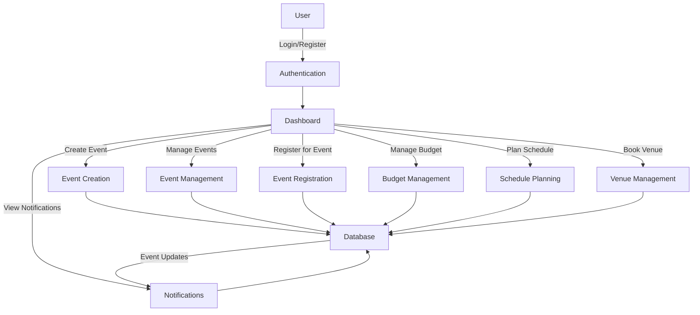
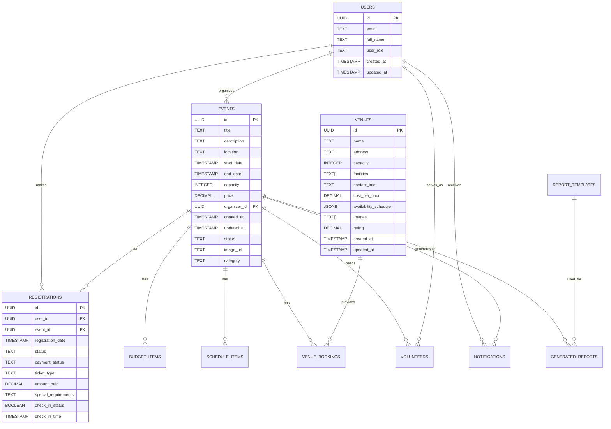

# Event Management System

This is a comprehensive Event Management System built with [Next.js](https://nextjs.org) and Supabase, designed to help organizers create and manage events efficiently.

## Getting Started

### Prerequisites

- Node.js 18.x or later
- npm or yarn
- Supabase account and project setup

### Setup Instructions

1. **Clone the repository**

```bash
git clone <repository-url>
cd event-management-system
```

2. **Install dependencies**

```bash
npm install
# or
yarn install
```

3. **Set up environment variables**

Create a `.env.local` file in the root directory with the following variables:

```
NEXT_PUBLIC_SUPABASE_URL=your_supabase_url
NEXT_PUBLIC_SUPABASE_ANON_KEY=your_supabase_anon_key
SUPABASE_SERVICE_ROLE_KEY=your_service_role_key
```

4. **Initialize the database**

Run the SQL scripts found in `src/sql/` directory in your Supabase SQL editor to set up the database schema.

5. **Run the development server**

```bash
npm run dev
# or
yarn dev
```

Open [http://localhost:3000](http://localhost:3000) with your browser to see the application.

## Application Structure

The application follows a Next.js App Router structure with the following main sections:

- **Authentication**: User login and registration
- **Dashboard**: Main interface for organizers and participants
- **Events Management**: Create, edit, and manage events
- **Budget Management**: Track and manage event budgets
- **Venue Management**: Book and manage venues
- **Schedule Planning**: Create and manage event schedules
- **Notifications**: System and event notifications

This project uses [`next/font`](https://nextjs.org/docs/app/building-your-application/optimizing/fonts) to automatically optimize and load [Geist](https://vercel.com/font), a custom font.

## System Architecture

### Flow Chart



### Entity Relationship Diagram



## Database Schema

The database schema is defined in SQL files located in the `src/sql/` directory:

1. `user.sql` - Defines the users table and related authentication functions
2. `event_management_tables.sql` - Defines all other tables for event management

Below is a partial listing of the key tables:

```sql
-- Users Table
CREATE TABLE users (
    id UUID REFERENCES auth.users(id) PRIMARY KEY,
    email TEXT UNIQUE NOT NULL,
    full_name TEXT NOT NULL,
    user_role TEXT NOT NULL CHECK (user_role IN ('admin', 'organizer', 'participant', 'sponsor')),
    created_at TIMESTAMP WITH TIME ZONE DEFAULT TIMEZONE('utc', NOW()),
    updated_at TIMESTAMP WITH TIME ZONE DEFAULT TIMEZONE('utc', NOW())
);

-- Events Table
CREATE TABLE events (
    id UUID PRIMARY KEY DEFAULT uuid_generate_v4(),
    title TEXT NOT NULL,
    description TEXT NOT NULL,
    location TEXT NOT NULL,
    start_date TIMESTAMP WITH TIME ZONE NOT NULL,
    end_date TIMESTAMP WITH TIME ZONE NOT NULL,
    capacity INTEGER NOT NULL CHECK (capacity > 0),
    price DECIMAL NOT NULL CHECK (price >= 0),
    organizer_id UUID NOT NULL REFERENCES users(id),
    created_at TIMESTAMP WITH TIME ZONE DEFAULT TIMEZONE('utc', NOW()),
    updated_at TIMESTAMP WITH TIME ZONE DEFAULT TIMEZONE('utc', NOW()),
    status TEXT NOT NULL CHECK (status IN ('draft', 'published', 'cancelled', 'completed')),
    image_url TEXT,
    category TEXT NOT NULL
);
```

For the complete database schema, please refer to the SQL files in the `src/sql/` directory.

## Learn More

To learn more about the technologies used in this project:

- [Next.js Documentation](https://nextjs.org/docs)
- [Supabase Documentation](https://supabase.io/docs)

## Deployment

The application can be deployed on Vercel or any other hosting platform that supports Next.js applications.

```bash
npm run build
npm start
```

For more details on deployment options, refer to the [Next.js deployment documentation](https://nextjs.org/docs/app/building-your-application/deploying).
