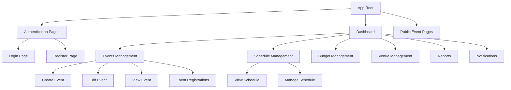
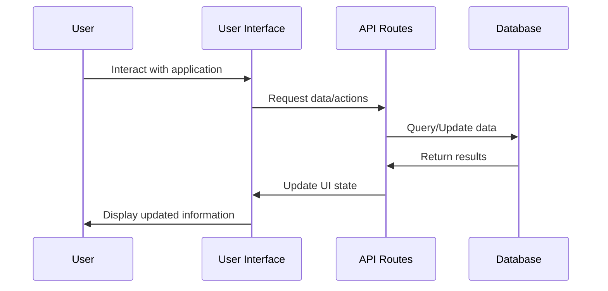
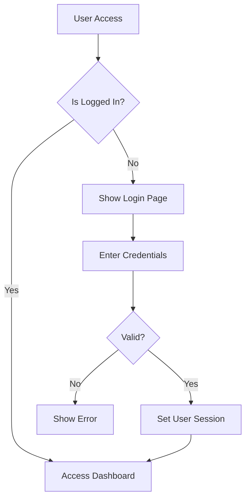
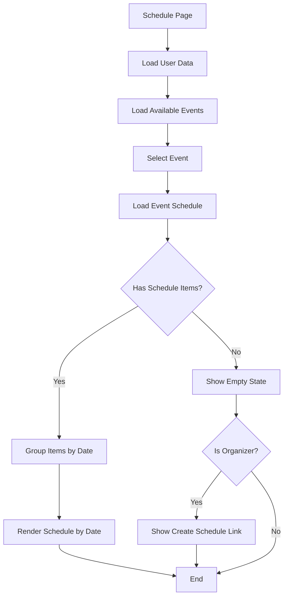
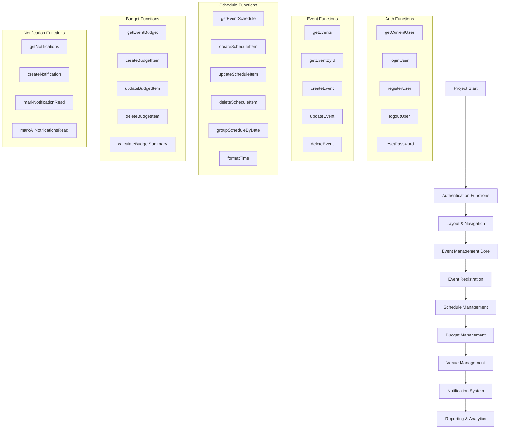
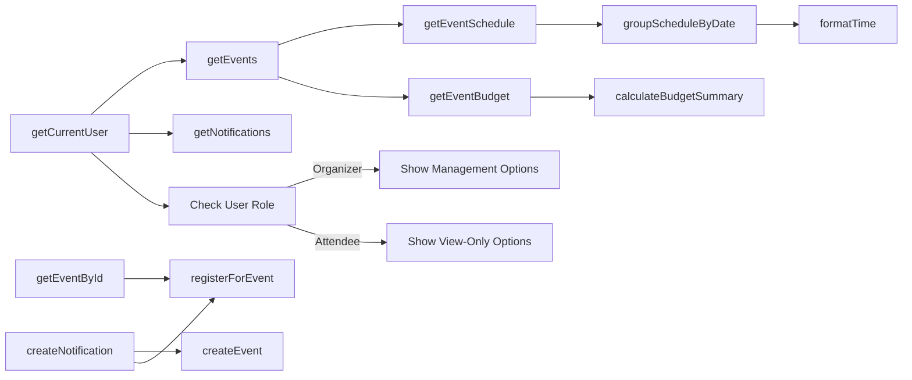

# Event Management System Documentation

## Overview

The Event Management System is a web application that allows users to create, manage, and attend events. The system provides features for event registration, scheduling, budgeting, venue management, and notifications.

## Function Development Planning

This section outlines all the functions required to build the application, organized by priority and development sequence.

### Phase 1: Authentication & Core Framework

1. **Authentication Functions**
   - `getCurrentUser()` - Retrieve the current authenticated user
   - `loginUser(email, password)` - Authenticate and login users
   - `registerUser(userData)` - Register new users
   - `logoutUser()` - Log out and clear user session
   - `resetPassword(email)` - Send password reset email

2. **Base Layout & Navigation Functions**
   - `DashboardLayout()` - Main layout component for authenticated areas
   - `PublicLayout()` - Layout for public-facing pages
   - `Navigation()` - Navigation menu based on user role

### Phase 2: Event Management Core

1. **Event CRUD Functions**
   - `getEvents()` - Fetch all events accessible to the user
   - `getEventById(eventId)` - Fetch a single event by ID
   - `createEvent(eventData)` - Create a new event
   - `updateEvent(eventId, eventData)` - Update existing event
   - `deleteEvent(eventId)` - Delete an event

2. **Event Registration Functions**
   - `registerForEvent(eventId, userData)` - Register user for an event
   - `getEventRegistrations(eventId)` - Get all registrations for an event
   - `cancelRegistration(registrationId)` - Cancel an event registration
   - `checkRegistrationStatus(eventId, userId)` - Check if a user is registered

### Phase 3: Schedule Management

1. **Schedule Functions**
   - `getEventSchedule(eventId)` - Fetch schedule for a specific event
   - `createScheduleItem(eventId, itemData)` - Create a schedule item
   - `updateScheduleItem(itemId, itemData)` - Update a schedule item
   - `deleteScheduleItem(itemId)` - Delete a schedule item
   - `groupScheduleByDate(scheduleItems)` - Group schedule items by date
   - `formatTime(timeString)` - Format time for display

### Phase 4: Budget Management

1. **Budget Functions**
   - `getEventBudget(eventId)` - Get budget for a specific event
   - `createBudgetItem(eventId, itemData)` - Create a new budget item
   - `updateBudgetItem(itemId, itemData)` - Update a budget item
   - `deleteBudgetItem(itemId)` - Delete a budget item
   - `calculateBudgetSummary(budgetItems)` - Calculate budget totals

### Phase 5: Venue Management

1. **Venue Functions**
   - `getVenues()` - Get all venues
   - `getVenueById(venueId)` - Get a specific venue
   - `createVenue(venueData)` - Create a new venue
   - `updateVenue(venueId, venueData)` - Update a venue
   - `deleteVenue(venueId)` - Delete a venue
   - `checkVenueAvailability(venueId, date)` - Check if a venue is available

### Phase 6: Notification System

1. **Notification Functions**
   - `getNotifications(userId)` - Get notifications for a user
   - `createNotification(userData, message)` - Create a notification
   - `markNotificationRead(notificationId)` - Mark a notification as read
   - `markAllNotificationsRead(userId)` - Mark all notifications as read

### Phase 7: Reporting & Analytics

1. **Reporting Functions**
   - `generateEventReport(eventId)` - Generate report for an event
   - `getAttendanceStats(eventId)` - Get attendance statistics
   - `getBudgetSummary(eventId)` - Get budget summary
   - `exportReportToCsv(reportData)` - Export report to CSV
   - `visualizeData(dataSet, type)` - Generate data visualizations

## Architecture

The application is built using:

- **Next.js**: React framework for server-rendered applications
- **TypeScript**: For type-safe code
- **Tailwind CSS**: For styling
- **Supabase**: For backend database and authentication

## Component Structure

## Data Flow

## Schedule Page Component Functionality

### Key Functions

1. **SchedulePage Component**
   - Main component for the event schedule view

2. **useEffect Hook**
   - Initializes component by loading user data and events
   - Output: Sets user information and available events

3. **loadEventSchedule**
   - Fetches schedule items for a selected event
   - Input: eventId (string)
   - Output: Updates scheduleItems state with fetched data

4. **handleEventChange**
   - Handles event selection from dropdown
   - Input: Select element change event
   - Output: Updates selectedEvent state and triggers schedule loading

5. **groupedSchedule**
   - Groups schedule items by date for organized display
   - Input: scheduleItems array
   - Output: Object with dates as keys and arrays of schedule items as values

6. **formatTime**
   - Formats time strings for display
   - Input: Time string
   - Output: Formatted time string (e.g., "09:00 AM")

## Authentication Flow

## Schedule Management Flow

## Detailed Code Functionality

### Schedule Page Component

The `SchedulePage` component in `src/app/dashboard/schedule/page.tsx` handles the display of event schedules:

1. **State Management**:
   - `user`: Stores the current user's information
   - `events`: List of available events
   - `selectedEvent`: The currently selected event ID
   - `scheduleItems`: Schedule items for the selected event
   - `isLoading`: Loading state indicator

2. **Data Loading**:
   - Initial data loading with useEffect to fetch user and events
   - Event schedule loading through `loadEventSchedule` function
   - Data grouping with `groupedSchedule` for organized display

3. **UI Components**:
   - Event selector dropdown
   - Loading spinners
   - Schedule display grouped by date
   - "Manage Schedule" link for organizers

### Database Interactions

The component interacts with the database through utility functions:

- `getCurrentUser()`: Retrieves the currently logged-in user
- `getEvents()`: Fetches events available to the user
- `getEventSchedule(eventId)`: Gets schedule items for a specific event

### Role-Based Features

- Regular users can view event schedules
- Organizers have additional capabilities to manage schedules

## API Endpoints

The application uses several API endpoints for data operations:

- Authentication endpoints (`/api/auth/*`)
- Event management endpoints (`/api/events/*`)
- Budget management endpoints (`/api/budgets/*`)
- Notification endpoints (`/api/notifications/*`)

## Future Improvements

1. Add calendar view for schedules
2. Implement event filtering and search
3. Add mobile notifications
4. Enhance reporting capabilities
5. Add multi-language support

## Function Implementation Flowchart

## Function Dependencies

